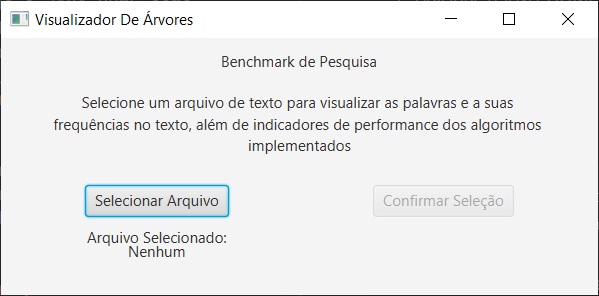
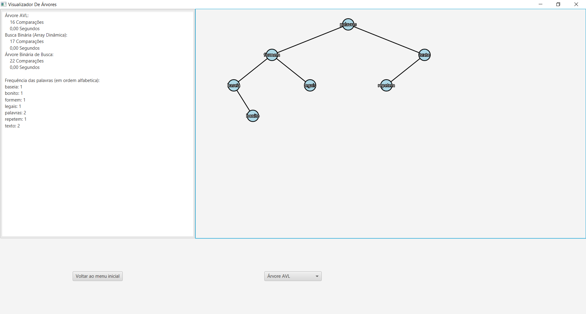
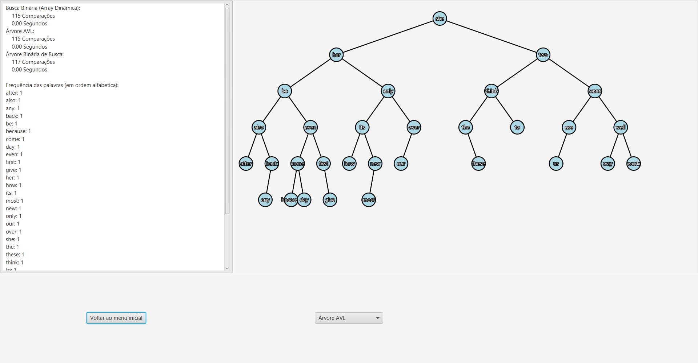

# ArvereBinarie

Um visualizador de árvores binárias com palavras, projeto feito em Java e com a biblioteca JavaFX para a visualização de árvores binárias.
O projeto inclui arquivos FXML, controladores e classes de estrutura (nós, árvores, desenho).

## O que é este projeto

- Aplicação desktop em Java para visualização de árvores binárias (BST / AVL) utilizando palavras em vez de números.
- Interface gráfica construída com JavaFX e arquivos FXML (`MenuInicial.fxml`, `MenuVisualizacao.fxml`).
- Código modular (possui `module-info.java`) e usa o plugin `javafx-maven-plugin` para facilitar execução com Maven.

## Utilização

No menu do programa selecione a opção "Selecionar Arquivo", então selecione um arquivo de texto (.txt), e clique em "Confirmar Seleção".


O programa vai realizar a criação de uma arvore binária balanceada com base nas palavras do texto.



## Requisitos

- Java JDK 21.
- Variável de ambiente `JAVA_HOME` apontando para o JDK 21.

Observação: o projeto já inclui um wrapper do maven, e declara dependências do JavaFX (`javafx-controls`, `javafx-fxml`) no `pom.xml` e usa `javafx-maven-plugin` para executar a aplicação, então não é necessário instalar nada além do JDK.

## Como executar (Windows)

1. Abra o powershell na raiz do projeto (onde está o `pom.xml`).
2. Adicione o JAVA_HOME como variavel de ambiente
```powershell
$env:JAVA_HOME = 'C:\Caminho\Do\Java\...\jdk-21'
```
3. Rode o comando abaixo para executar a aplicação diretamente:
```powershell
.\mvnw.cmd clean javafx:run
```

## Executar pelo IntelliJ IDEA

- No gerenciador de projetos IntelliJ utilize o botão de abrir pasta e selecione o diretório raiz (onde está o `pom.xml`).
- O Intellij cuidará da versão do JDK e das dependências.
- Execute a classe `com.gjls.arverebinarie.MenuInicial`.

## Estrutura útil do projeto

- `src/main/java/com/gjls/arverebinarie`: código fonte Java (controllers, classes de árvore, etc.).
- `src/main/resources/com/gjls/arverebinarie`: arquivos FXML (`MenuInicial.fxml`, `MenuVisualizacao.fxml`).
